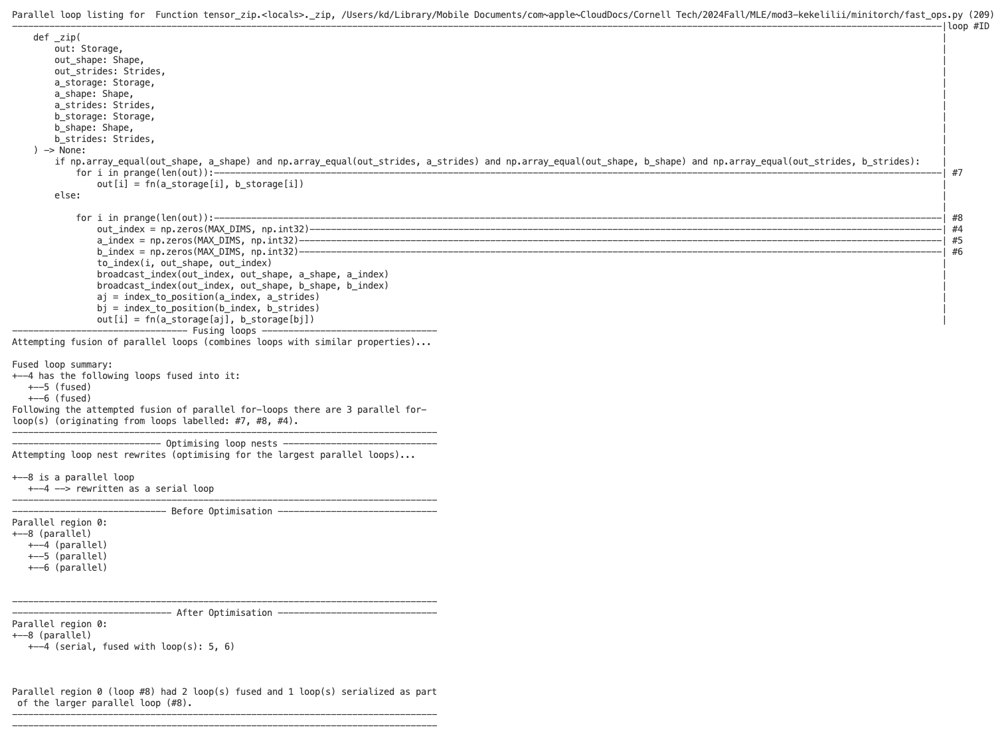
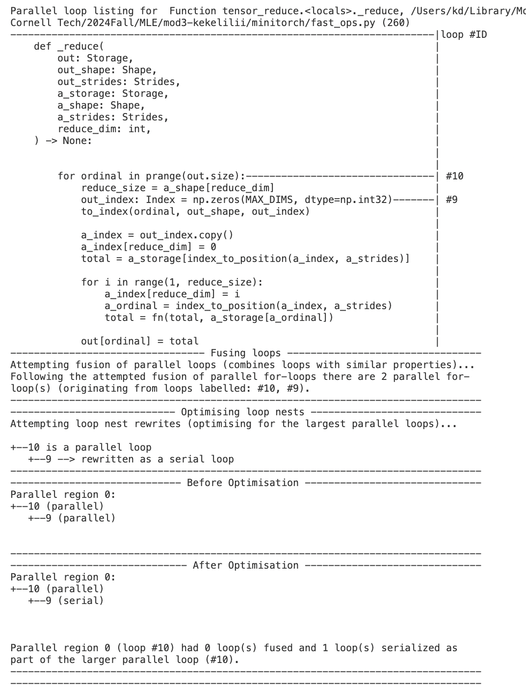
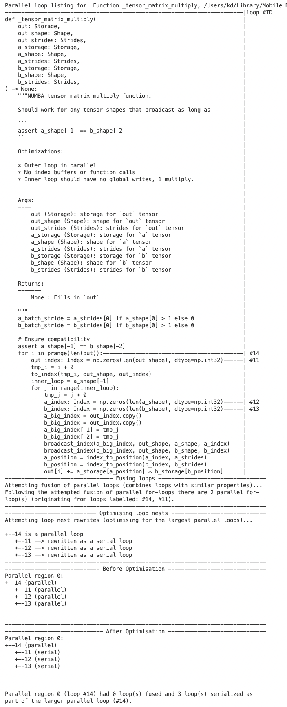

# MiniTorch Module 3


* Docs: https://minitorch.github.io/

* Overview: https://minitorch.github.io/module3.html


You will need to modify `tensor_functions.py` slightly in this assignment.

* Tests:

```
python run_tests.py
```

* Note:

Several of the tests for this assignment will only run if you are on a GPU machine and will not
run on github's test infrastructure. Please follow the instructions to setup up a colab machine
to run these tests.

This assignment requires the following files from the previous assignments. You can get these by running

```bash
python sync_previous_module.py previous-module-dir current-module-dir
```

The files that will be synced are:

        minitorch/tensor_data.py minitorch/tensor_functions.py minitorch/tensor_ops.py minitorch/operators.py minitorch/scalar.py minitorch/scalar_functions.py minitorch/module.py minitorch/autodiff.py minitorch/module.py project/run_manual.py project/run_scalar.py project/run_tensor.py minitorch/operators.py minitorch/module.py minitorch/autodiff.py minitorch/tensor.py minitorch/datasets.py minitorch/testing.py minitorch/optim.py


# Task 3.1 NUMBA diagnostics
## Map


## Zip


## Reduce


# Task 3.2 Tensor-matrix multiply


# Task 3.5
I calculated the mean time taken for 10 epochs during each training.
## CPU
** Simple Dataset **
```
project/run_fast_tensor.py --BACKEND cpu --HIDDEN 10 --DATASET simple --RATE 0.05
```
** Mean time taken 10 epochs: 0.784723219871521 **

Epoch  0  loss  6.7673685187413195 correct 22 <br>
Epoch  10  loss  6.775854167214876 correct 31 <br>
Epoch  20  loss  6.353084015112615 correct 32 <br>
Epoch  30  loss  5.314513267450655 correct 39 <br>
Epoch  40  loss  5.88949565047518 correct 44 <br>
Epoch  50  loss  4.279772840189287 correct 44 <br>
Epoch  60  loss  2.9038857621754035 correct 47 <br>
Epoch  70  loss  1.430940709419717 correct 49 <br>
Epoch  80  loss  1.599004982717117 correct 50 <br>
Epoch  90  loss  1.7379272194584707 correct 50 <br>
Epoch  100  loss  0.9556078060823715 correct 50 <br>
Epoch  110  loss  1.7318007349667217 correct 49 <br>
Epoch  120  loss  1.7170090278182915 correct 50 <br>
Epoch  130  loss  0.7966792860889279 correct 50 <br>
Epoch  140  loss  0.879137934024855 correct 50 <br>
Epoch  150  loss  0.7381878672560377 correct 50 <br>
Epoch  160  loss  0.08485686330250537 correct 50 <br>
Epoch  170  loss  0.48343166972297597 correct 50 <br>
Epoch  180  loss  0.02760974670151746 correct 50 <br>
Epoch  190  loss  1.0758685601552298 correct 50 <br>
Epoch  200  loss  0.7847910202003997 correct 49 <br>
Epoch  210  loss  0.4240385080035794 correct 50 <br>
Epoch  220  loss  0.1449983514082769 correct 50 <br>
Epoch  230  loss  0.93867107899285 correct 50 <br>
Epoch  240  loss  0.2597671710172625 correct 50 <br>
Epoch  250  loss  0.46833359824525417 correct 50 <br>
Epoch  260  loss  0.33525519984811025 correct 50 <br>
Epoch  270  loss  0.09700161231958548 correct 49 <br>
Epoch  280  loss  0.14762196676759004 correct 50 <br>
Epoch  290  loss  0.3558984920356146 correct 50 <br>
Epoch  300  loss  0.11848657973452809 correct 49 <br>
Epoch  310  loss  0.9264103283300278 correct 50 <br>
Epoch  320  loss  0.16235023088995792 correct 50 <br>
Epoch  330  loss  0.9362908224373178 correct 50 <br>
Epoch  340  loss  0.9449912326927878 correct 50 <br>
Epoch  350  loss  0.8530593049794878 correct 50 <br>
Epoch  360  loss  0.5728373630989779 correct 50 <br>
Epoch  370  loss  0.9414218393711562 correct 50 <br>
Epoch  380  loss  0.6869140044423926 correct 50 <br>
Epoch  390  loss  0.6963301925775481 correct 50 <br>
Epoch  400  loss  0.04918705696907524 correct 50 <br>
Epoch  410  loss  0.8057654433374297 correct 50 <br>
Epoch  420  loss  0.13736905390171117 correct 49 <br>
Epoch  430  loss  0.16347754083050803 correct 50 <br>
Epoch  440  loss  0.6393478103352552 correct 50 <br>
Epoch  450  loss  0.02983529184308702 correct 50 <br>
Epoch  460  loss  0.07776448319231144 correct 50 <br>
Epoch  470  loss  0.08532709583353885 correct 50 <br>
Epoch  480  loss  0.13662710936741046 correct 50 <br>
Epoch  490  loss  0.07174414839560395 correct 50 <br>
Mean time taken 10 epochs: 0.784723219871521 <br>

** Split Dataset **
```
project/run_fast_tensor.py --BACKEND cpu --HIDDEN 10 --DATASET split --RATE 0.05
```
** Mean time taken 10 epochs: 0.7739562273025513 **

Epoch  0  loss  7.092934147764554 correct 16 <br>
Epoch  10  loss  6.254269866237001 correct 34 <br>
Epoch  20  loss  6.321076070998769 correct 34 <br>
Epoch  30  loss  4.731775236390832 correct 34 <br>
Epoch  40  loss  6.07220692658064 correct 34 <br>
Epoch  50  loss  5.453510539121298 correct 34 <br>
Epoch  60  loss  4.929172304967293 correct 34 <br>
Epoch  70  loss  7.407425498055856 correct 34 <br>
Epoch  80  loss  6.095212167879706 correct 34 <br>
Epoch  90  loss  5.278093404902567 correct 34 <br>
Epoch  100  loss  8.443701572722937 correct 34 <br>
Epoch  110  loss  4.745182359563154 correct 34 <br>
Epoch  120  loss  6.464990221462691 correct 34 <br>
Epoch  130  loss  7.388487996924368 correct 34 <br>
Epoch  140  loss  4.332710642119575 correct 34 <br>
Epoch  150  loss  5.7095023617800305 correct 35 <br>
Epoch  160  loss  8.125670765358908 correct 37 <br>
Epoch  170  loss  5.623678800711263 correct 37 <br>
Epoch  180  loss  4.6933200635404955 correct 38 <br>
Epoch  190  loss  4.854430667616611 correct 40 <br>
Epoch  200  loss  5.960129389102098 correct 41 <br>
Epoch  210  loss  5.196323429479005 correct 41 <br>
Epoch  220  loss  4.671402582812045 correct 42 <br>
Epoch  230  loss  7.765900588949343 correct 43 <br>
Epoch  240  loss  4.290978851617056 correct 44 <br>
Epoch  250  loss  3.470199938127623 correct 43 <br>
Epoch  260  loss  2.526290291008473 correct 44 <br>
Epoch  270  loss  4.965711304669442 correct 44 <br>
Epoch  280  loss  5.355223496425373 correct 44 <br>
Epoch  290  loss  4.792541443828149 correct 44 <br>
Epoch  300  loss  3.2102687095585933 correct 43 <br>
Epoch  310  loss  4.750804083078322 correct 44 <br>
Epoch  320  loss  2.8985065331916173 correct 44 <br>
Epoch  330  loss  3.5696254361860023 correct 44 <br>
Epoch  340  loss  2.4737174230376384 correct 44 <br>
Epoch  350  loss  2.05422399370139 correct 45 <br>
Epoch  360  loss  2.0433347146250544 correct 47 <br>
Epoch  370  loss  2.6660136062782263 correct 48 <br>
Epoch  380  loss  2.726373863799582 correct 48 <br>
Epoch  390  loss  1.3155403764548168 correct 49 <br>
Epoch  400  loss  0.7496863293007867 correct 48 <br>
Epoch  410  loss  2.015072240179179 correct 48 <br>
Epoch  420  loss  2.0577101051690376 correct 49 <br>
Epoch  430  loss  1.634301641659118 correct 50 <br>
Epoch  440  loss  2.6573713811988555 correct 50 <br>
Epoch  450  loss  1.8467767273187896 correct 49 <br>
Epoch  460  loss  1.1063931667904976 correct 49 <br>
Epoch  470  loss  1.3483565891714866 correct 50 <br>
Epoch  480  loss  0.8317901409230923 correct 49 <br>
Epoch  490  loss  1.0054792315995456 correct 49 <br>
Mean time taken 10 epochs: 0.7739562273025513 <br>

** XOR Dataset **
```
project/run_fast_tensor.py --BACKEND cpu --HIDDEN 10 --DATASET xor --RATE 0.05
```
** Mean time taken 10 epochs: 0.770450587272644 **

Epoch  0  loss  7.02416865746998 correct 21 <br>
Epoch  10  loss  6.855790887305696 correct 30 <br>
Epoch  20  loss  6.697475241909263 correct 29 <br>
Epoch  30  loss  7.259252032823049 correct 29 <br>
Epoch  40  loss  6.4072160535450235 correct 29 <br>
Epoch  50  loss  6.301461947472052 correct 29 <br>
Epoch  60  loss  6.439087316667221 correct 30 <br>
Epoch  70  loss  6.170289090577588 correct 34 <br>
Epoch  80  loss  6.241399256344458 correct 36 <br>
Epoch  90  loss  5.536066334335155 correct 36 <br>
Epoch  100  loss  5.964392372179233 correct 38 <br>
Epoch  110  loss  4.950778168281579 correct 40 <br>
Epoch  120  loss  5.045728180853126 correct 41 <br>
Epoch  130  loss  4.617998458125756 correct 41 <br>
Epoch  140  loss  4.7601968028635655 correct 42 <br>
Epoch  150  loss  2.9447188879680835 correct 42 <br>
Epoch  160  loss  3.2495312647329606 correct 43 <br>
Epoch  170  loss  4.089055053262364 correct 43 <br>
Epoch  180  loss  4.8132112867558865 correct 43 <br>
Epoch  190  loss  3.4881513391969174 correct 43 <br>
Epoch  200  loss  5.385582536691384 correct 44 <br>
Epoch  210  loss  2.059886396227167 correct 43 <br>
Epoch  220  loss  3.1213336773894116 correct 44 <br>
Epoch  230  loss  4.929085104747239 correct 47 <br>
Epoch  240  loss  1.9277207931353213 correct 46 <br>
Epoch  250  loss  1.0202381748632565 correct 46 <br>
Epoch  260  loss  1.2659699012666257 correct 47 <br>
Epoch  270  loss  5.1490802828981925 correct 47 <br>
Epoch  280  loss  1.987978856320467 correct 47 <br>
Epoch  290  loss  2.270031087594565 correct 47 <br>
Epoch  300  loss  2.4574088442860766 correct 47 <br>
Epoch  310  loss  1.8767910791015918 correct 47 <br>
Epoch  320  loss  0.8835466936900365 correct 48 <br>
Epoch  330  loss  1.760548574557937 correct 48 <br>
Epoch  340  loss  1.4691521270377181 correct 48 <br>
Epoch  350  loss  0.840397355577552 correct 48 <br>
Epoch  360  loss  3.4945330203868314 correct 48 <br>
Epoch  370  loss  2.552203720603927 correct 49 <br>
Epoch  380  loss  1.488214332032163 correct 49 <br>
Epoch  390  loss  0.4871619625252421 correct 49 <br>
Epoch  400  loss  0.49897376440701297 correct 49 <br>
Epoch  410  loss  1.6723341161628957 correct 49 <br>
Epoch  420  loss  0.8226233283517528 correct 49 <br>
Epoch  430  loss  0.8214476932238197 correct 48 <br>
Epoch  440  loss  2.707117209758265 correct 49 <br>
Epoch  450  loss  1.3835341891852593 correct 49 <br>
Epoch  460  loss  0.3332584033388388 correct 48 <br>
Epoch  470  loss  1.469661244018185 correct 50 <br>
Epoch  480  loss  0.10911355436721433 correct 48 <br>
Epoch  490  loss  1.0444392906223872 correct 50 <br>
Mean time taken 10 epochs: 0.770450587272644 <br>


