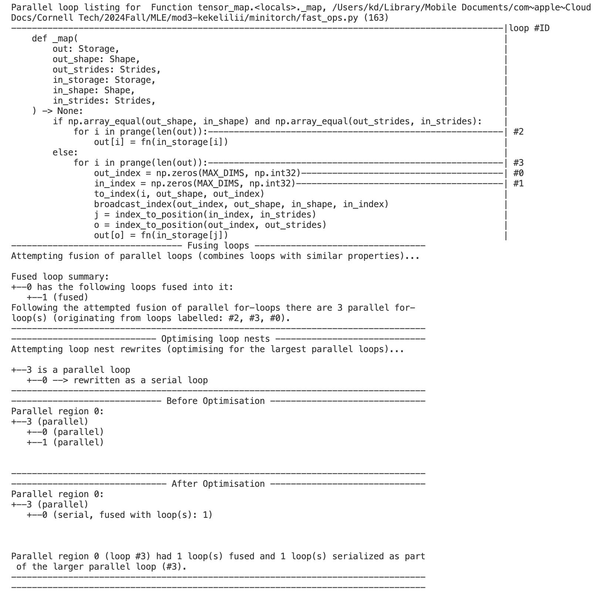

# MiniTorch Module 3


* Docs: https://minitorch.github.io/

* Overview: https://minitorch.github.io/module3.html


You will need to modify `tensor_functions.py` slightly in this assignment.

* Tests:

```
python run_tests.py
```

* Note:

Several of the tests for this assignment will only run if you are on a GPU machine and will not
run on github's test infrastructure. Please follow the instructions to setup up a colab machine
to run these tests.

This assignment requires the following files from the previous assignments. You can get these by running

```bash
python sync_previous_module.py previous-module-dir current-module-dir
```

The files that will be synced are:

        minitorch/tensor_data.py minitorch/tensor_functions.py minitorch/tensor_ops.py minitorch/operators.py minitorch/scalar.py minitorch/scalar_functions.py minitorch/module.py minitorch/autodiff.py minitorch/module.py project/run_manual.py project/run_scalar.py project/run_tensor.py minitorch/operators.py minitorch/module.py minitorch/autodiff.py minitorch/tensor.py minitorch/datasets.py minitorch/testing.py minitorch/optim.py


# Task 3.1 NUMBA diagnostics
## Map


## Zip


## Reduce


# Task 3.2 Tensor-matrix multiply


# Task 3.5
I calculated the mean time taken for 10 epochs during each training.
## CPU
** Simple Dataset **
```
project/run_fast_tensor.py --BACKEND cpu --HIDDEN 10 --DATASET simple --RATE 0.05
```
** Mean time taken 10 epochs: 0.784723219871521 **

Epoch  0  loss  6.7673685187413195 correct 22 <br>
Epoch  10  loss  6.775854167214876 correct 31 <br>
Epoch  20  loss  6.353084015112615 correct 32 <br>
Epoch  30  loss  5.314513267450655 correct 39 <br>
Epoch  40  loss  5.88949565047518 correct 44 <br>
Epoch  50  loss  4.279772840189287 correct 44 <br>
Epoch  60  loss  2.9038857621754035 correct 47 <br>
Epoch  70  loss  1.430940709419717 correct 49 <br>
Epoch  80  loss  1.599004982717117 correct 50 <br>
Epoch  90  loss  1.7379272194584707 correct 50 <br>
Epoch  100  loss  0.9556078060823715 correct 50 <br>
Epoch  110  loss  1.7318007349667217 correct 49 <br>
Epoch  120  loss  1.7170090278182915 correct 50 <br>
Epoch  130  loss  0.7966792860889279 correct 50 <br>
Epoch  140  loss  0.879137934024855 correct 50 <br>
Epoch  150  loss  0.7381878672560377 correct 50 <br>
Epoch  160  loss  0.08485686330250537 correct 50 <br>
Epoch  170  loss  0.48343166972297597 correct 50 <br>
Epoch  180  loss  0.02760974670151746 correct 50 <br>
Epoch  190  loss  1.0758685601552298 correct 50 <br>
Epoch  200  loss  0.7847910202003997 correct 49 <br>
Epoch  210  loss  0.4240385080035794 correct 50 <br>
Epoch  220  loss  0.1449983514082769 correct 50 <br>
Epoch  230  loss  0.93867107899285 correct 50 <br>
Epoch  240  loss  0.2597671710172625 correct 50 <br>
Epoch  250  loss  0.46833359824525417 correct 50 <br>
Epoch  260  loss  0.33525519984811025 correct 50 <br>
Epoch  270  loss  0.09700161231958548 correct 49 <br>
Epoch  280  loss  0.14762196676759004 correct 50 <br>
Epoch  290  loss  0.3558984920356146 correct 50 <br>
Epoch  300  loss  0.11848657973452809 correct 49 <br>
Epoch  310  loss  0.9264103283300278 correct 50 <br>
Epoch  320  loss  0.16235023088995792 correct 50 <br>
Epoch  330  loss  0.9362908224373178 correct 50 <br>
Epoch  340  loss  0.9449912326927878 correct 50 <br>
Epoch  350  loss  0.8530593049794878 correct 50 <br>
Epoch  360  loss  0.5728373630989779 correct 50 <br>
Epoch  370  loss  0.9414218393711562 correct 50 <br>
Epoch  380  loss  0.6869140044423926 correct 50 <br>
Epoch  390  loss  0.6963301925775481 correct 50 <br>
Epoch  400  loss  0.04918705696907524 correct 50 <br>
Epoch  410  loss  0.8057654433374297 correct 50 <br>
Epoch  420  loss  0.13736905390171117 correct 49 <br>
Epoch  430  loss  0.16347754083050803 correct 50 <br>
Epoch  440  loss  0.6393478103352552 correct 50 <br>
Epoch  450  loss  0.02983529184308702 correct 50 <br>
Epoch  460  loss  0.07776448319231144 correct 50 <br>
Epoch  470  loss  0.08532709583353885 correct 50 <br>
Epoch  480  loss  0.13662710936741046 correct 50 <br>
Epoch  490  loss  0.07174414839560395 correct 50 <br>
Mean time taken 10 epochs: 0.784723219871521 <br>

** Split Dataset **
```
project/run_fast_tensor.py --BACKEND cpu --HIDDEN 10 --DATASET split --RATE 0.05
```
** Mean time taken 10 epochs: 0.7739562273025513 **

Epoch  0  loss  7.092934147764554 correct 16 <br>
Epoch  10  loss  6.254269866237001 correct 34 <br>
Epoch  20  loss  6.321076070998769 correct 34 <br>
Epoch  30  loss  4.731775236390832 correct 34 <br>
Epoch  40  loss  6.07220692658064 correct 34 <br>
Epoch  50  loss  5.453510539121298 correct 34 <br>
Epoch  60  loss  4.929172304967293 correct 34 <br>
Epoch  70  loss  7.407425498055856 correct 34 <br>
Epoch  80  loss  6.095212167879706 correct 34 <br>
Epoch  90  loss  5.278093404902567 correct 34 <br>
Epoch  100  loss  8.443701572722937 correct 34 <br>
Epoch  110  loss  4.745182359563154 correct 34 <br>
Epoch  120  loss  6.464990221462691 correct 34 <br>
Epoch  130  loss  7.388487996924368 correct 34 <br>
Epoch  140  loss  4.332710642119575 correct 34 <br>
Epoch  150  loss  5.7095023617800305 correct 35 <br>
Epoch  160  loss  8.125670765358908 correct 37 <br>
Epoch  170  loss  5.623678800711263 correct 37 <br>
Epoch  180  loss  4.6933200635404955 correct 38 <br>
Epoch  190  loss  4.854430667616611 correct 40 <br>
Epoch  200  loss  5.960129389102098 correct 41 <br>
Epoch  210  loss  5.196323429479005 correct 41 <br>
Epoch  220  loss  4.671402582812045 correct 42 <br>
Epoch  230  loss  7.765900588949343 correct 43 <br>
Epoch  240  loss  4.290978851617056 correct 44 <br>
Epoch  250  loss  3.470199938127623 correct 43 <br>
Epoch  260  loss  2.526290291008473 correct 44 <br>
Epoch  270  loss  4.965711304669442 correct 44 <br>
Epoch  280  loss  5.355223496425373 correct 44 <br>
Epoch  290  loss  4.792541443828149 correct 44 <br>
Epoch  300  loss  3.2102687095585933 correct 43 <br>
Epoch  310  loss  4.750804083078322 correct 44 <br>
Epoch  320  loss  2.8985065331916173 correct 44 <br>
Epoch  330  loss  3.5696254361860023 correct 44 <br>
Epoch  340  loss  2.4737174230376384 correct 44 <br>
Epoch  350  loss  2.05422399370139 correct 45 <br>
Epoch  360  loss  2.0433347146250544 correct 47 <br>
Epoch  370  loss  2.6660136062782263 correct 48 <br>
Epoch  380  loss  2.726373863799582 correct 48 <br>
Epoch  390  loss  1.3155403764548168 correct 49 <br>
Epoch  400  loss  0.7496863293007867 correct 48 <br>
Epoch  410  loss  2.015072240179179 correct 48 <br>
Epoch  420  loss  2.0577101051690376 correct 49 <br>
Epoch  430  loss  1.634301641659118 correct 50 <br>
Epoch  440  loss  2.6573713811988555 correct 50 <br>
Epoch  450  loss  1.8467767273187896 correct 49 <br>
Epoch  460  loss  1.1063931667904976 correct 49 <br>
Epoch  470  loss  1.3483565891714866 correct 50 <br>
Epoch  480  loss  0.8317901409230923 correct 49 <br>
Epoch  490  loss  1.0054792315995456 correct 49 <br>
Mean time taken 10 epochs: 0.7739562273025513 <br>

** XOR Dataset **
```
project/run_fast_tensor.py --BACKEND cpu --HIDDEN 10 --DATASET xor --RATE 0.05
```
** Mean time taken 10 epochs: 0.770450587272644 **

Epoch  0  loss  7.02416865746998 correct 21 <br>
Epoch  10  loss  6.855790887305696 correct 30 <br>
Epoch  20  loss  6.697475241909263 correct 29 <br>
Epoch  30  loss  7.259252032823049 correct 29 <br>
Epoch  40  loss  6.4072160535450235 correct 29 <br>
Epoch  50  loss  6.301461947472052 correct 29 <br>
Epoch  60  loss  6.439087316667221 correct 30 <br>
Epoch  70  loss  6.170289090577588 correct 34 <br>
Epoch  80  loss  6.241399256344458 correct 36 <br>
Epoch  90  loss  5.536066334335155 correct 36 <br>
Epoch  100  loss  5.964392372179233 correct 38 <br>
Epoch  110  loss  4.950778168281579 correct 40 <br>
Epoch  120  loss  5.045728180853126 correct 41 <br>
Epoch  130  loss  4.617998458125756 correct 41 <br>
Epoch  140  loss  4.7601968028635655 correct 42 <br>
Epoch  150  loss  2.9447188879680835 correct 42 <br>
Epoch  160  loss  3.2495312647329606 correct 43 <br>
Epoch  170  loss  4.089055053262364 correct 43 <br>
Epoch  180  loss  4.8132112867558865 correct 43 <br>
Epoch  190  loss  3.4881513391969174 correct 43 <br>
Epoch  200  loss  5.385582536691384 correct 44 <br>
Epoch  210  loss  2.059886396227167 correct 43 <br>
Epoch  220  loss  3.1213336773894116 correct 44 <br>
Epoch  230  loss  4.929085104747239 correct 47 <br>
Epoch  240  loss  1.9277207931353213 correct 46 <br>
Epoch  250  loss  1.0202381748632565 correct 46 <br>
Epoch  260  loss  1.2659699012666257 correct 47 <br>
Epoch  270  loss  5.1490802828981925 correct 47 <br>
Epoch  280  loss  1.987978856320467 correct 47 <br>
Epoch  290  loss  2.270031087594565 correct 47 <br>
Epoch  300  loss  2.4574088442860766 correct 47 <br>
Epoch  310  loss  1.8767910791015918 correct 47 <br>
Epoch  320  loss  0.8835466936900365 correct 48 <br>
Epoch  330  loss  1.760548574557937 correct 48 <br>
Epoch  340  loss  1.4691521270377181 correct 48 <br>
Epoch  350  loss  0.840397355577552 correct 48 <br>
Epoch  360  loss  3.4945330203868314 correct 48 <br>
Epoch  370  loss  2.552203720603927 correct 49 <br>
Epoch  380  loss  1.488214332032163 correct 49 <br>
Epoch  390  loss  0.4871619625252421 correct 49 <br>
Epoch  400  loss  0.49897376440701297 correct 49 <br>
Epoch  410  loss  1.6723341161628957 correct 49 <br>
Epoch  420  loss  0.8226233283517528 correct 49 <br>
Epoch  430  loss  0.8214476932238197 correct 48 <br>
Epoch  440  loss  2.707117209758265 correct 49 <br>
Epoch  450  loss  1.3835341891852593 correct 49 <br>
Epoch  460  loss  0.3332584033388388 correct 48 <br>
Epoch  470  loss  1.469661244018185 correct 50 <br>
Epoch  480  loss  0.10911355436721433 correct 48 <br>
Epoch  490  loss  1.0444392906223872 correct 50 <br>
Mean time taken 10 epochs: 0.770450587272644 <br>


## GPU
** Simple Dataset **
```
project/run_fast_tensor.py --BACKEND gpu --HIDDEN 10 --DATASET simple --RATE 0.05
```
** Mean time taken 10 epochs: 12.721478757858277 **

Epoch  0  loss  6.765575061791135 correct 31 <br>
Epoch  10  loss  6.224134070867302 correct 31 <br>
Epoch  20  loss  5.876462975102594 correct 31 <br>
Epoch  30  loss  5.801713638435279 correct 31 <br>
Epoch  40  loss  4.440332301096638 correct 31 <br>
Epoch  50  loss  4.526801005990176 correct 31 <br>
Epoch  60  loss  4.586838789147811 correct 47 <br>
Epoch  70  loss  3.8978755770377713 correct 47 <br>
Epoch  80  loss  2.117315668025332 correct 47 <br>
Epoch  90  loss  1.3011016620146507 correct 48 <br>
Epoch  100  loss  1.4848638525606772 correct 48 <br>
Epoch  110  loss  1.0318924671851153 correct 49 <br>
Epoch  120  loss  0.5379958653257347 correct 49 <br>
Epoch  130  loss  0.41128930040820905 correct 49 <br>
Epoch  140  loss  0.8031032585201027 correct 50 <br>
Epoch  150  loss  0.5535801495592784 correct 50 <br>
Epoch  160  loss  0.7212368573039956 correct 50 <br>
Epoch  170  loss  0.8616687707682825 correct 50 <br>
Epoch  180  loss  0.5111698476925212 correct 50 <br>
Epoch  190  loss  0.21955173820704266 correct 50 <br>
Epoch  200  loss  0.102456653963034 correct 50 <br>
Epoch  210  loss  0.8331433832456413 correct 50 <br>
Epoch  220  loss  0.722793787235119 correct 50 <br>
Epoch  230  loss  0.17166888592965665 correct 50 <br>
Epoch  240  loss  0.6579595420173625 correct 50 <br>
Epoch  250  loss  0.3767206419794433 correct 50 <br>
Epoch  260  loss  0.11897009277845158 correct 50 <br>
Epoch  270  loss  0.07856549561701766 correct 50 <br>
Epoch  280  loss  0.02202127771336314 correct 50 <br>
Epoch  290  loss  0.559376310642881 correct 50 <br>
Epoch  300  loss  0.010801746400613982 correct 50 <br>
Epoch  310  loss  0.6098793087376873 correct 50 <br>
Epoch  320  loss  0.012204711641472271 correct 50 <br>
Epoch  330  loss  0.050705863333814015 correct 50 <br>
Epoch  340  loss  0.253316938127531 correct 50 <br>
Epoch  350  loss  0.5538640362128932 correct 50 <br>
Epoch  360  loss  0.36990061715016337 correct 50 <br>
Epoch  370  loss  0.005252849663443081 correct 50 <br>
Epoch  380  loss  0.2707263045923225 correct 50 <br>
Epoch  390  loss  0.06721131185445867 correct 50 <br>
Epoch  400  loss  0.106083169019252 correct 50 <br>
Epoch  410  loss  0.0038215459936380832 correct 50 <br>
Epoch  420  loss  0.43212926232628746 correct 50 <br>
Epoch  430  loss  0.012787172421627318 correct 50 <br>
Epoch  440  loss  0.016658212471049504 correct 50 <br>
Epoch  450  loss  0.018783591066401456 correct 50 <br>
Epoch  460  loss  0.31465101977885673 correct 50 <br>
Epoch  470  loss  0.003982572629338235 correct 50 <br>
Epoch  480  loss  0.023801062806026275 correct 50 <br>
Epoch  490  loss  0.03289001750487628 correct 50 <br>
Mean time taken 10 epochs: 12.721478757858277 <br>

** Split Dataset **
```
project/run_fast_tensor.py --BACKEND gpu --HIDDEN 10 --DATASET split --RATE 0.05
```
** Mean time taken 10 epochs: 12.464561467170716 **

Epoch  0  loss  7.003365617678363 correct 21 <br>
Epoch  10  loss  7.002574257257511 correct 28 <br>
Epoch  20  loss  6.747306326846885 correct 28 <br>
Epoch  30  loss  6.470711067320864 correct 28 <br>
Epoch  40  loss  6.7887105998642 correct 28 <br>
Epoch  50  loss  7.199609189235906 correct 28 <br>
Epoch  60  loss  7.059600830808145 correct 28 <br>
Epoch  70  loss  6.692103080673017 correct 28 <br>
Epoch  80  loss  6.867074290161694 correct 28 <br>
Epoch  90  loss  6.6280065846285625 correct 28 <br>
Epoch  100  loss  6.986770839023895 correct 28 <br>
Epoch  110  loss  6.314200500180504 correct 28 <br>
Epoch  120  loss  6.6327781468326945 correct 28 <br>
Epoch  130  loss  6.690047619323117 correct 28 <br>
Epoch  140  loss  6.533777887221512 correct 29 <br>
Epoch  150  loss  6.267231820578792 correct 29 <br>
Epoch  160  loss  7.46384694538828 correct 32 <br>
Epoch  170  loss  6.314194793214903 correct 33 <br>
Epoch  180  loss  5.972511635631233 correct 37 <br>
Epoch  190  loss  6.559444382643283 correct 38 <br>
Epoch  200  loss  5.884961776089559 correct 38 <br>
Epoch  210  loss  6.633123582353925 correct 40 <br>
Epoch  220  loss  6.633183308343089 correct 39 <br>
Epoch  230  loss  7.085795552480878 correct 40 <br>
Epoch  240  loss  5.406958342539333 correct 40 <br>
Epoch  250  loss  4.422746921571679 correct 44 <br>
Epoch  260  loss  4.196741896400863 correct 43 <br>
Epoch  270  loss  4.980014900189617 correct 48 <br>
Epoch  280  loss  3.7943564385623696 correct 48 <br>
Epoch  290  loss  2.500489222840302 correct 49 <br>
Epoch  300  loss  2.6227540169756587 correct 49 <br>
Epoch  310  loss  2.472228090310269 correct 49 <br>
Epoch  320  loss  2.362617266829111 correct 50 <br>
Epoch  330  loss  1.8353374726278864 correct 49 <br>
Epoch  340  loss  2.44060088744222 correct 49 <br>
Epoch  350  loss  1.590730419992367 correct 50 <br>
Epoch  360  loss  1.8857322279023265 correct 50 <br>
Epoch  370  loss  1.2672282778565005 correct 50 <br>
Epoch  380  loss  1.2912516429362348 correct 50 <br>
Epoch  390  loss  1.2791901022793999 correct 50 <br>
Epoch  400  loss  1.1441127598622263 correct 50 <br>
Epoch  410  loss  0.47287998752909555 correct 50 <br>
Epoch  420  loss  0.3682058745617608 correct 50 <br>
Epoch  430  loss  1.4248782356159817 correct 50 <br>
Epoch  440  loss  0.9032198258989503 correct 49 <br>
Epoch  450  loss  0.3720989862398307 correct 50 <br>
Epoch  460  loss  0.26059987119153816 correct 50 <br>
Epoch  470  loss  0.6611295727402455 correct 50 <br>
Epoch  480  loss  0.9133364134881652 correct 50 <br>
Epoch  490  loss  0.4522548220562439 correct 50 <br>
Mean time taken 10 epochs: 12.464561467170716 <br>

** XOR Dataset **
```
project/run_fast_tensor.py --BACKEND gpu --HIDDEN 10 --DATASET xor --RATE 0.05
```
** Mean time taken 10 epochs: 12.408630146980286 **

Epoch  0  loss  7.039063113849171 correct 24 <br>
Epoch  10  loss  7.091539760116295 correct 30 <br>
Epoch  20  loss  6.898511395733136 correct 30 <br>
Epoch  30  loss  5.846914770171384 correct 30 <br>
Epoch  40  loss  5.754516488249304 correct 30 <br>
Epoch  50  loss  6.324184282597176 correct 30 <br>
Epoch  60  loss  6.094129181931668 correct 35 <br>
Epoch  70  loss  6.651719134008045 correct 35 <br>
Epoch  80  loss  6.659641277895988 correct 36 <br>
Epoch  90  loss  5.2904813232133305 correct 37 <br>
Epoch  100  loss  4.360355960779388 correct 36 <br>
Epoch  110  loss  4.9558407238907485 correct 36 <br>
Epoch  120  loss  5.075637185761313 correct 37 <br>
Epoch  130  loss  3.9570359261013226 correct 37 <br>
Epoch  140  loss  4.898674011417768 correct 38 <br>
Epoch  150  loss  4.582186770848134 correct 38 <br>
Epoch  160  loss  4.38405533696831 correct 39 <br>
Epoch  170  loss  3.873310145182556 correct 39 <br>
Epoch  180  loss  4.339556783188568 correct 40 <br>
Epoch  190  loss  7.08386867609071 correct 39 <br>
Epoch  200  loss  5.16011228897145 correct 39 <br>
Epoch  210  loss  3.262984604882103 correct 39 <br>
Epoch  220  loss  3.98660372920553 correct 39 <br>
Epoch  230  loss  4.084144550012813 correct 40 <br>
Epoch  240  loss  3.1386770316852584 correct 40 <br>
Epoch  250  loss  5.116575656630095 correct 41 <br>
Epoch  260  loss  3.91364905092886 correct 42 <br>
Epoch  270  loss  2.861964309930393 correct 41 <br>
Epoch  280  loss  2.168705896763903 correct 43 <br>
Epoch  290  loss  3.270426943058927 correct 44 <br>
Epoch  300  loss  2.5206361344657973 correct 44 <br>
Epoch  310  loss  2.805335177647865 correct 47 <br>
Epoch  320  loss  3.1941889190482486 correct 47 <br>
Epoch  330  loss  2.1896048690041163 correct 49 <br>    
Epoch  340  loss  3.986203065897374 correct 49 <br>
Epoch  350  loss  2.481113422297367 correct 49 <br>
Epoch  360  loss  4.047924982991801 correct 45 <br>
Epoch  370  loss  1.6725999508909843 correct 48 <br>
Epoch  380  loss  1.0228953363761693 correct 49 <br>
Epoch  390  loss  1.4060551781157506 correct 48 <br>
Epoch  400  loss  2.991224143259521 correct 47 <br>
Epoch  410  loss  2.546407239804445 correct 49 <br>
Epoch  420  loss  2.1725936637948275 correct 48 <br>
Epoch  430  loss  2.502867857910756 correct 47 <br>
Epoch  440  loss  0.3709762114114429 correct 49 <br>
Epoch  450  loss  2.28541422566129 correct 47 <br>
Epoch  460  loss  2.1606147101913984 correct 47 <br>
Epoch  470  loss  2.0505500934884138 correct 48 <br>
Epoch  480  loss  2.110892185509481 correct 48 <br>
Epoch  490  loss  1.1063953005682703 correct 49 <br>
Mean time taken 10 epochs: 12.408630146980286 <br>

# Large Model 200 Hidden Units
```
project/run_fast_tensor.py --BACKEND gpu --HIDDEN 200 --DATASET split --RATE 0.05
```
** GPU Mean time taken 10 epochs: 23.568731532096862 **

Epoch  0  loss  26.488810857154196 correct 19 <br>
Epoch  10  loss  7.060037384013745 correct 29 <br>
Epoch  20  loss  3.746055749501493 correct 38 <br>
Epoch  30  loss  3.243606338229994 correct 44 <br>
Epoch  40  loss  2.425279072039889 correct 45 <br>
Epoch  50  loss  5.7425151031200885 correct 44 <br>
Epoch  60  loss  2.2487046030721323 correct 48 <br>
Epoch  70  loss  0.5694327903723458 correct 46 <br>
Epoch  80  loss  2.4256977454784017 correct 48 <br>
Epoch  90  loss  1.310534587106336 correct 50 <br>
Epoch  100  loss  0.6888883492179627 correct 50 <br>
Epoch  110  loss  0.878984527638083 correct 50 <br>
Epoch  120  loss  0.43957724842448653 correct 50 <br>
Epoch  130  loss  0.26049648092563055 correct 50 <br>
Epoch  140  loss  0.9499815410667654 correct 50 <br>
Epoch  150  loss  3.1301654240089865 correct 48 <br>
Epoch  160  loss  0.9051767135062729 correct 50 <br>
Epoch  170  loss  0.9213485327223104 correct 50 <br>
Epoch  180  loss  0.7232472900264516 correct 50 <br>
Epoch  190  loss  0.8031333808556105 correct 49 <br>
Epoch  200  loss  0.6927157229253299 correct 48 <br>
Epoch  210  loss  0.7399387857922991 correct 50 <br>
Epoch  220  loss  1.6820119390843367 correct 47 <br>
Epoch  230  loss  1.4397729091318132 correct 47 <br>
Epoch  240  loss  0.5557666577459923 correct 50 <br>
Epoch  250  loss  0.8453185511059309 correct 50 <br>
Epoch  260  loss  2.797961435791622 correct 47 <br>
Epoch  270  loss  0.16883758471795857 correct 47 <br>
Epoch  280  loss  0.8131178570439783 correct 50 <br>
Epoch  290  loss  2.72115555662615 correct 50 <br>
Epoch  300  loss  0.16247991987504948 correct 50 <br>
Epoch  310  loss  8.262962337410546 correct 47 <br>
Epoch  320  loss  0.5548823512386468 correct 50 <br>
Epoch  330  loss  0.1910141089265058 correct 48 <br>
Epoch  340  loss  0.9086532737049748 correct 50 <br>
Epoch  350  loss  0.7402611398277696 correct 50 <br>
Epoch  360  loss  0.6254934598639367 correct 49 <br>
Epoch  370  loss  0.5648686311244991 correct 50 <br>
Epoch  380  loss  1.225674297737543 correct 47 <br>
Epoch  390  loss  0.24825045858253425 correct 49 <br>
Epoch  400  loss  0.10769615301420699 correct 50 <br>
Epoch  410  loss  1.1572965395362194 correct 47 <br>
Epoch  420  loss  0.5336230115175717 correct 50 <br>
Epoch  430  loss  0.6217638710895961 correct 50 <br>
Epoch  440  loss  0.6733555704865827 correct 50 <br>
Epoch  450  loss  0.21879304925271081 correct 50 <br>
Epoch  460  loss  1.5172474716447635 correct 50 <br>
Epoch  470  loss  0.4514373828115517 correct 49 <br>
Epoch  480  loss  0.5137490328582797 correct 50 <br>
Epoch  490  loss  0.13584860476872646 correct 50 <br>
Mean time taken 10 epochs: 23.568731532096862 <br>


```
project/run_fast_tensor.py --BACKEND cpu --HIDDEN 200 --DATASET split --RATE 0.05
```
** CPU Mean time taken 10 epochs: 20.239588809013366 **

Epoch  0  loss  5.843406509302373 correct 37 <br>
Epoch  10  loss  4.773215723660987 correct 42 <br>
Epoch  20  loss  4.308159745441243 correct 47 <br>
Epoch  30  loss  2.348757897524853 correct 46 <br>
Epoch  40  loss  4.347525310678856 correct 41 <br>
Epoch  50  loss  2.663729646276143 correct 43 <br>
Epoch  60  loss  3.3675297132584427 correct 45 <br>
Epoch  70  loss  1.1389490604938988 correct 46 <br>
Epoch  80  loss  1.4040507269736238 correct 49 <br>
Epoch  90  loss  3.0107185382125667 correct 45 <br>
Epoch  100  loss  1.5012539400934684 correct 46 <br>
Epoch  110  loss  0.726039769453401 correct 47 <br>
Epoch  120  loss  1.3067327449417407 correct 50 <br>
Epoch  130  loss  1.2429708191733424 correct 50 <br>
Epoch  140  loss  0.19541064334752745 correct 50 <br>
Epoch  150  loss  1.0106833304306737 correct 49 <br>
Epoch  160  loss  0.8074157960747229 correct 49 <br>
Epoch  170  loss  1.7839238582176795 correct 49 <br>
Epoch  180  loss  1.2867195989173958 correct 50 <br>
Epoch  190  loss  1.469029458559704 correct 48 <br>
Epoch  200  loss  3.0927050706183987 correct 47 <br>
Epoch  210  loss  1.8169722231654566 correct 47 <br>
Epoch  220  loss  0.6723679163720935 correct 50 <br>
Epoch  230  loss  0.9689592526396517 correct 50 <br>
Epoch  240  loss  1.1297081695327256 correct 49 <br>
Epoch  250  loss  0.98912570312973 correct 49 <br>
Epoch  260  loss  0.1633105805352544 correct 48 <br>
Epoch  270  loss  0.5802979579631744 correct 50 <br>
Epoch  280  loss  0.3533884690723204 correct 48 <br>
Epoch  290  loss  0.25460362649911905 correct 50 <br>
Epoch  300  loss  0.08118047254717523 correct 50 <br>
Epoch  310  loss  0.47755012100679095 correct 49 <br>
Epoch  320  loss  0.8067342671628844 correct 50 <br>
Epoch  330  loss  0.2510535391735403 correct 50 <br>
Epoch  340  loss  1.0561284707854524 correct 50 <br>
Epoch  350  loss  1.3939068919576625 correct 49 <br>
Epoch  360  loss  1.4016273677724111 correct 49 <br>
Epoch  370  loss  0.2353322587158154 correct 49 <br>
Epoch  380  loss  0.19893472468531215 correct 50 <br>
Epoch  390  loss  0.9412867088136797 correct 50 <br>
Epoch  400  loss  1.130661643202612 correct 50 <br>
Epoch  410  loss  0.6292999864615024 correct 50 <br>
Epoch  420  loss  1.0232690592725224 correct 50 <br>
Epoch  430  loss  0.26399939272031536 correct 50 <br>
Epoch  440  loss  0.7853658814656859 correct 50 <br>
Epoch  450  loss  0.5072781737059617 correct 50 <br>
Epoch  460  loss  0.3402732299134045 correct 50 <br>
Epoch  470  loss  0.7656558476653632 correct 49 <br>
Epoch  480  loss  1.2608275458245417 correct 48 <br>
Epoch  490  loss  0.02472337300913361 correct 49 <br>
Mean time taken 10 epochs: 20.239588809013366 <br>